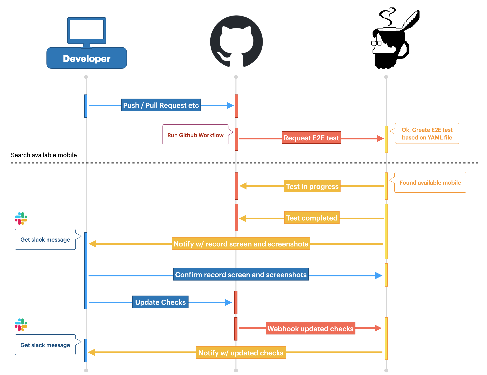

# DIMBULAについて

DIMBULAは、[株式会社Kunimasu](https://kunimasu.com/)が開発・運営するプロダクトです。

弊社管理のモバイル実機端末を、以下の目的でご利用になることを想定しています。

## DIMBULA Computing
弊社が管理する実機モバイルを、ブラウザからリモートで一時利用できるプロダクトです。

[DIMBULA Computing](./docs/computing.md)

## DIMBULA E2E
Github Actionsと連携した、Mobile CI（Continuous Integration）プロダクトです。

[DIMBULA E2E](./docs/e2e.md)

# DIMBULAアプリ
DIMBULAは、専用のSlackアプリとGithubアプリがあります。Slackアプリはインストール必須で、DIMBULA E2Eをご利用になる場合は、Githubアプリもインストールください。

<!--

-->

Githubアプリは、Slackアプリをインストール後、`/dimbula me`から行います。

**現在、招待制でご利用いただいています。**

# 特徴
DIMBULAの特徴は4つです。

## E2Eテスト手順はノーコード

E2Eテストするための手順は、YAML形式のテキストファイルに記述します。記述する内容は、テストする端末名、OSのバージョン、OSの言語、テストの手順等を記述しますが、DIMBULA Computing、画面操作を記録してYAMLファイルへ出力する機能がありますのでご活用ください。

[YAMLフォーマット](feataure/yaml_format.md)

## 実機とエッジコンピュータ

ご利用いただく端末は全て実機で、その傍らには実機を制御するエッジコンピュータがペアで配備されています。E2Eテストでは、エッジコンピュータがテスト手順を制御するので、テストプログラムで不具合が起きたり、テストプログラムがモバイルリソースに与える影響は抑えられています。

[エッジコンピュータの仕様](feataure/edge_computer_spec.md)

## Githubインテグレーション
DIMBULAのGithubアプリを組織もしくは個人にインストールすると、インストールした対象の組織や個人のリポジトリのGithub Actionsと連携した実機モバイルCIサービス「DIMBULA E2E」をご利用いただけます。Github Workflow上で、DIMBULA E2Eの専用アクションを記述してテストをリクエストすると、DIMBULAはテストしたいモバイル端末を確保し、Github Workflowで生成したアーティファクトをインストール、テスト手順を逐次実行します。テスト実行中は、画面録画され、必要に応じてスクリーンショットを撮ります。テスト終了後に、録画された画面やスクリーンショットを確認、Github Checksを更新します。

[Githubインテグレーション](feataure/github_integration.md)

## Slackインテグレーション
DIMBULAでは、SlackのSlashコマンドを使ってDIMBULAに要求します。Slackに参画するメンバーがDIMBULAのユーザになるため、DIMBULAにユーザを作成したり、招待するといったことは不要です。また、利用者への様々な通知は、Slackの通知システムをそのまま利用します。Slackに備わるメンバー管理、通知機能、Slackのインタラクティブなコミュニケーションを最大限に活用したユーザインターフェースになっています。

[Slackインテグレーション](feataure/slack_integration.md)

# DIMBULA E2Eの流れ

