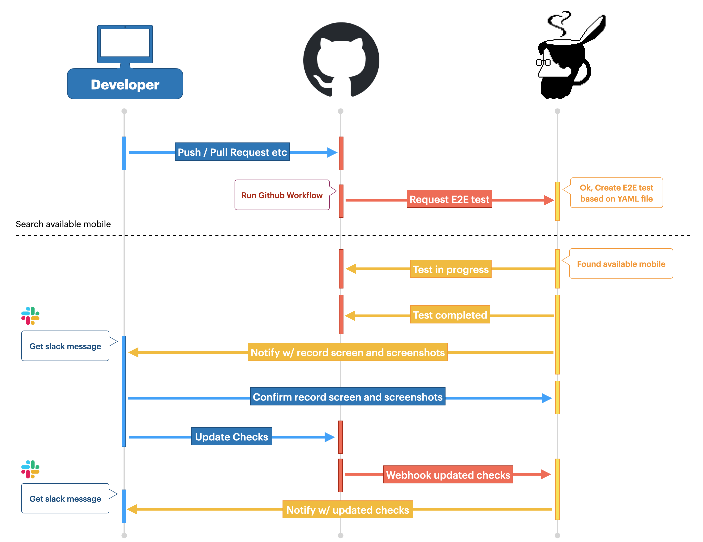

# DIMBULAについて

DIMBULAは、[株式会社Kunimasu](https://kunimasu.com/)が開発・運営するプロダクトです。

弊社管理のモバイル実機端末を、以下の目的でご利用になることを想定しています。

1. **DIMBULA atWork**: 実機のモバイル端末をスポット利用する
2. **DIMBULA teaBreak**: Github Workflowと連携した、アプリケーションのE2Eテストで継続利用する

DIMBULAでは、専用のSlackアプリとGithubアプリがあります。DIMBULA atWork / teaBreak共に、Slackのアプリはインストール必須で、teaBreakをご利用になる場合は、Githubアプリもインストールください。

# 特徴

DIMBULAの特徴は4つです。

## E2Eテスト手順はノーコード

E2Eテストするための手順は、YAML形式のテキストファイルに記述します。記述する内容は、テストする端末名、OSのバージョン、OSの言語、テストの手順等を記述しますが、DIMBULA atWorkは、画面操作を記録してYAMLファイルへ出力する機能がありますのでご活用ください。

* [YAMLフォーマット](feataure/yaml_format.md)

## 実機とエッジコンピュータ

ご利用いただく端末は全て実機で、その傍らには実機を制御するエッジコンピュータがペアで配備されています。E2Eテストでは、エッジコンピュータがテスト手順を制御するので、テストプログラムで不具合が起きたり、テストプログラムがモバイルリソースに与える影響は抑えられています。

* [エッジコンピュータの仕様](feataure/edge_computer_spec.md)

## Github連携

DIMBULAのGithubアプリを組織もしくは個人にインストールいただくと、インストールした対象の組織や個人のリポジトリのGithub Workflowと連携した実機モバイルCIサービス「DIMBULA teaBreak」をご利用いただけます。
Github Workflow上で、DIMBULA teaBreakのトリガーとなる専用アクションを記述してテストのリクエストを行うと、リクエストを受信したDIMBULAはテストしたいモバイル端末を確保し、Github Workflowで生成したアーティファクトをインストール、テスト手順に従い手順を逐次実行します。テスト実行中は、録画され、必要に応じてスクリーンショットを撮ります。テスト終了後に、録画された画面やスクリーンショットを目視で確認し、Github Checksを更新することで合否判定を行います。

* [エッジコンピュータの仕様](feataure/edge_computer_spec.md)

## Slack連携

DIMBULAでは、SlackのSlashコマンドを使ってDIMBULAに要求します。Slackに参画するメンバーがDIMBULAのSlashコマンドを使えますので、DIMBULAに利用者を招待する等は不要です。また、Githubからの通知は、Slack上の任意のチャンネルに通知されます。Slackに備わるメンバー管理、通知機能、Slackのインタラクティブなコミュニケーションを最大限に活用したユーザインターフェースになっています。

* [エッジコンピュータの仕様](feataure/edge_computer_spec.md)

# DIMBULA teaBreakの流れ

# デモ

事前準備として、DIMBULAのSlackアプリとGithubアプリはインストール済みです。

## DIMBULA atWork

## DIMBULA teaBreak
