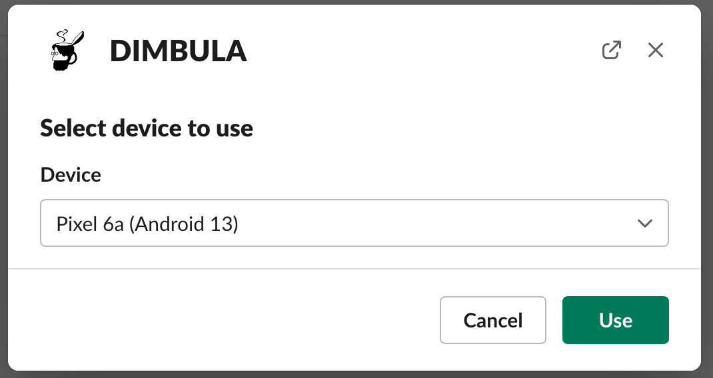

# DIMBULA Computing

弊社が管理する実機モバイルをリモートで一時利用できるプロダクトで、以下の用途でご利用いただくことを想定しています。

* DIMBULA E2Eのテスト条件・手順を作成するため
* ユーザサポートなどで、エンドユーザが利用する同一の機種・OSバージョンを一時的に利用するため

<iframe style="max-width: 100%;" width="560" height="315" src="https://www.youtube.com/embed/MsljQHqg21s" title="YouTube video player" frameborder="0" allow="accelerometer; autoplay; clipboard-write; encrypted-media; gyroscope; picture-in-picture; web-share" allowfullscreen></iframe>

# セットアップ
事前にDIMBULAのSlackアプリがインストールされていれば、直ぐにご利用いただけます。詳しくは [Slackセットアップ](./slack_setup.md) をご覧ください。 

# 使い方

1. `/dimbula use`で利用したいモバイルを選択 利用できる空きモバイルを確保後、URLがポストされます
2. ブラウザでURLを表示し、映像再生ボタンで利用開始
3. 利用を終了するときは、ブラウザを閉じ、`/dimbula quit`でモバイルを解放する

もしアプリをインストールして使い帯場合は、 事前にインストールしたいアプリがあれば、ダウンロードできるURLを用意してください。映像再生後、設定ボタン押下し、`Send APK`ボタンでインストールするアプリのダウンロードURLを入力することで、実機にインストールできます。

# 空きモバイルの確保
`/dimbula use`で現在稼働するモバイルを表示します。この時点では既に他の利用者に確保されたモバイルも含めて、弊社で稼働するすべてのモバイルの種類が選択肢として現れます。

利用できる空きモバイルの検索します。

確保できれば、ブラウザで利用するURLがポストされます。

# ブラウザでリモート利用
URLをブラウザで表示すると、以下のような画面になります。 一番左のボタンを押下して、映像を再生します。

画面下部のボタンは左右にスクロールする場合があります。

映像が表示されると、各種ボタンが利用できます。左から：
* 映像停止ボタン
* 戻るボタン
* ホームボタン
* ボリュームダウンボタン
* ボリュームアップボタン
* 電源ボタン
* テキスト入力ボタン
* 画面操作記録ボタン
* 画面操作記録履歴ボタン
* 設定ボタン

また、タップ操作も以下をサポートします：
* シングルタップ
* ロングタップ
* スワイプ

## ボタン

### 映像停止
映像が表示されている場合に、押下できるボタンです。押下後、映像を停止できます。このボタンは映像開始ボタンとのトグルです。

### 戻るボタン
実機モバイルの戻るボタンと等価で、1つ画面を戻るなどができます。

### ホームボタン
実機モバイルのホームボタンと等価で、ホーム画面に戻れます。

### ボリュームダウンボタン
実機モバイルのボリュームダウンボタンと等価で、音量を1段階下げられます。

### ボリュームアップボタン
実機モバイルのボリュームアップボタンと等価で、音量を1段階上げられます。

### 電源ボタン
実機モバイルの電源ボタンと等価で、画面ロックにしたり解除するなど出来ます。

### テキスト入力ボタン
ボタン押下でプロンプトが表示されるので、そこにテキスト入力して送信できます。ただし送信できるテキストに日本語などマルチバイトを送信することはできません。具体的には [KEYCODE](https://developer.android.com/reference/android/view/KeyEvent) で送信できる文字のみで、これら文字を送信してから日本語に変換してください。

### 画面操作記録ボタン
ボタン操作、タップ操作を記録します。記憶した履歴は、画面操作記録履歴ボタンで確認できます。このボタンはトグルボタンで、記録開始すると記録終了のボタンになります。

### 画面操作記録履歴ボタン
記録した操作の履歴を一覧で表示します。再度押下すると一覧画面を閉じます。

### 設定ボタン
言語を切り替えるなど、設定に関する画面を表示します。

## 画面操作記録履歴画面
記録がない場合は、以下の画面になります。

記録がある場合は、以下の画面になります。

各履歴に対してできることは以下です:
* 並び替え
* 名前付け
* 削除

### 並び替え
ドラッグ&ドロップで各履歴を上下に移動させて操作の順番を入れ替えられます。

### 名前付け
`Add name`のフィールドに自由に操作の名前を付けられます。

### 削除
履歴を削除できます。

## ホタン
履歴に対して以下のボタンを用意しています。左から:
* 待ち時間追加ボタン
* スクリーンショット追加ボタン
* 履歴全削除ボタン
* YAMLファイルダウンロードボタン
* YAMLファイルアップロードボタン
* 履歴実行ボタン

### 待ち時間追加ボタン
ボタン押下でプロンプトが表示されるので、待ち時間を入力します。待ち時間は秒単位で入力できる他、Linuxの`sleep`と同じ引数が使えます。

待ち時間の目的は、サーバー通信時間やアニメーションなど、次の操作を実行する前に待機が必要な場合に、この明示的に挿入する待ち時間が活用出来ます。

入力後、履歴の最後に挿入されます。

### スクリーンショット追加ボタン
DIMBULA E2Eでは、任意のタイミングでスクリーンショットを撮れます。DIMBULA Computingではこの機能は働きませんが、E2Eで必要な箇所に挿入して使ってください。

ここで挿入したスクリーンショットは、E2Eテストの結果確認画面で確認できるようになります。

ボタン押下すると、プロンプトが表示されますので、スクリーンショットのファイル名を拡張子なしで入力します。

入力後、履歴の最後に挿入されます。

### 履歴全削除ボタン
確認のダイアログ後、履歴をすべて削除します。

### YAMLファイルダウンロードボタン
画面操作履歴は、DIMBULA E2Eのテスト条件・手順として利用できる形式でダウンロードできます。

ボタン押下で以下画面が表示されます。この画面では、記録した操作履歴に加えて、実機モバイルの情報とOSの言語、各操作間の待ち時間が設定されます。OSの言語は、現在表示している言語がデフォルトでチェックされていますが、E2Eテストでテストしたい言語を複数選択できるので、ここで他の言語をチェックください。

### YAMLファイルアップロードボタン
過去にダウンロードしたYAMLファイルをアップロードし、履歴に復元して使えます。YAMLファイルを持っていれば、過去の操作を改めて操作・記録する必要はなくなります。

### 履歴実行ボタン
履歴の操作を順番に実行します。実行する各操作の待ち時間は`step-wait-time`に依存しますが、これは設定画面で変更できます。

実行すると、終わった操作はグレー、現在の操作は黄色で色づけされます。

## 設定画面

設定画面でできることは以下です:
* OSの言語切り替え
* システムのナビゲーションバー変更
* 記録した履歴操作間の待ち時間
* APKファイルの送信
* ファイルの送信

### OSの言語切り替え
日英で切り替えが可能です。

### システムのナビゲーションバー変更
OSのナビゲーションバーの変更を行います。

モバイルの対応次第ですが、切り替え可能な種類は以下です：
* Gesture
* Two Buttons 
* Three Buttons 

未対応のナビゲーションバーを指定した場合、利用中のモバイルが切り替わりません。

### 記録した履歴操作間の待ち時間
DIMBULA E2Eで実行する各操作の待ち時間を設定できます。この時間はすべての操作間の待ち時間として設定されるので、特定の操作の次の時間を長めに待機させたいといった要望がある場合は、待ち時間追加ボタンで個別に待ち時間を追加してください。

### APKファイルの送信
APKファイルをダウンロードできるURLを入力します。入力後、APKファイルをモバイルにインストールします。

テストしたいアプリがある場合は、アプリをダウンロードできるURLを用意いただき、このボタンからURLを送信してください。

### ファイルの送信
APKを含むファイルをモバイルに送信したい場合にご利用いただけます。ファイルをダウンロードできるURLを入力後、モバイルはローカルストレージにダウンロードします。
