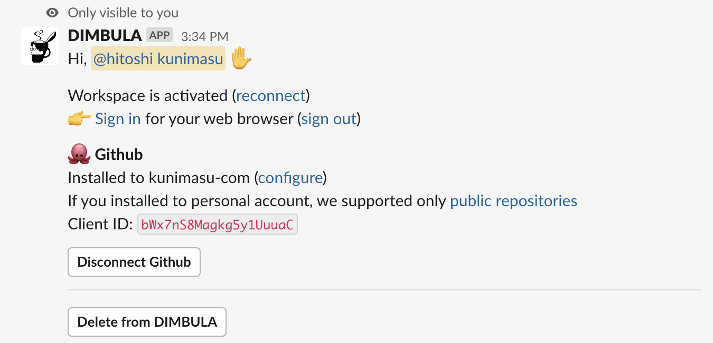

# Githubセットアップ

# アプリのインストール
DIMBULAのGithubアプリの`/dimbula me`を送信して、インストールリンクを取得します。このリンクをブラウザで表示します。

`install`をクリックし、インストール先を選択します。

通常、Githubアプリは、`install`リンクで表示される画面のように、複数の組織や個人にインストール出来ますが、DIMBULAをご利用になる場合は、以下の仕様にご注意ください。

* DIMBULA E2Eを使うためには、`/dimbula me`の`install`リンクからDIMBULA Githubアプリをインストールする必要がある
* DIMBULAのGithubアプリをインストールすると、DIMBULAとインストールしたGithubアプリが1対1で紐付けられる
* 紐付けられるGithubインストール先は1つだけ
* GithubのAPIの都合上、個人へインストールした場合、[Publicなリポジトリのみ](https://octokit.github.io/rest.js/v19#repos-list-for-user) のみ対応になる

インストールが成功すると、以下の画面が表示されます。

インストール後に再度`/dimbula me`を送信すると、`Installed to <インストール先>`といった表示になります。もし違う組織や個人へインストールしたいという場合は、一度`Disconnect Github`ボタンから連携を解除してください。連携がない状態で`/dimbula me`を送信すると、再度`install`リンクが表示されます。

# 通知を受け取る
DIMBULA E2Eを利用すると、テストが終わったときや、誰かがGithubのChecksを更新したときの通知を受けることができます。E2Eテストを始める前に、Slackのチャンネルに通知を受けたいリポジトリを登録しておきましょう。

[通知を受け取る](./receive_notification.md)
