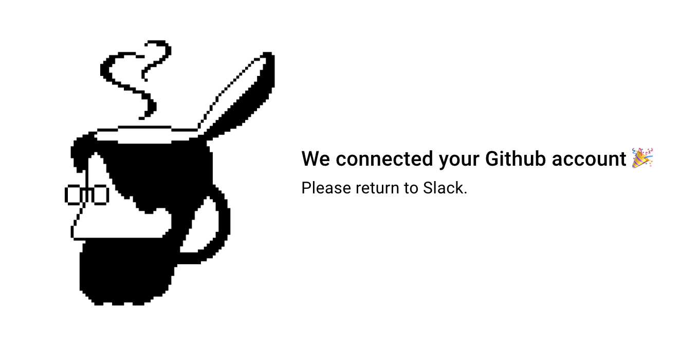
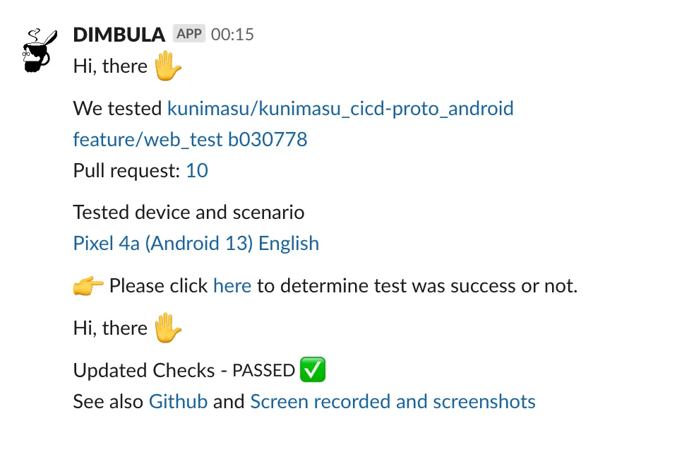

# 通知を受け取る
DIMBULA teaBreakでは、E2Eテストの終了時や、Github Checks更新時に、講読されたSlackチャンネルに通知してお知らせします。

通知を受け取る設定をしていなくても、DIMBULA teaBreakは機能しますが、テストが終了したことに気付かないといったことが起きますので、ここでは講読する方法を紹介します。

# Githubアカウントを接続する
DIMBULA teaBreakのE2Eテスト終了時に受け取りたい対象リポジトリと、通知先となるSlackチャンネルを登録するコマンドは、`/dimbula subscribe`で行います。

対象リポジトリを選択肢として表示するために、`/dimbula me`からGithubのアカウント接続を先に行う必要があります。Githubの下にある`connect`もしくは一度接続済みなら`reconnect`をクリックして、リンクをWebブラウザで表示します。

Webブラウザに以下のような表示がされれば、接続完了です。

# 講読する
通知を受信したいチャンネルで、`/dimbula subscribe`を送信すると、モーダル表示で講読したいリポジトリが選択肢として現れます。

接続したGithubアカウントの個人と所属する組織に、DIMBULAのGithubアプリがインストールされていれば、以下のように複数のリポジトリが候補になります。一度の検索では100件が最大の候補数になりますので、もし候補に現れてないリポジトリを選択したい場合は、`/dimbula subscribe <リポジトリのURL>`もしくは `/dimbula subscribe <リポジトリ所有者> <リポジトリ名>`で送信すると、対象を絞って登録できます。

以下を送信すると、1つに絞れた状態でモーダルを表示することが出来ます。
* `/dimbula-dev subscribe https://github.com/DIMBULA-dev/dimbula.github.io` 
* `/dimbula-dev subscribe DIMBULA-dev dimbula.github.io`

# 通知のイメージ
DIMBULA teaBreakで指定の言語、端末やOSバージョンの組み合わせで全てのE2Eテストが終えたときやChecksが更新されたときに、以下のような内容でポストされます。

