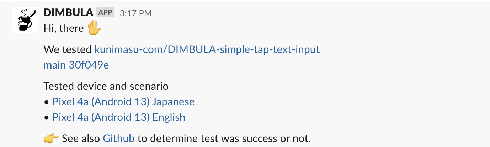
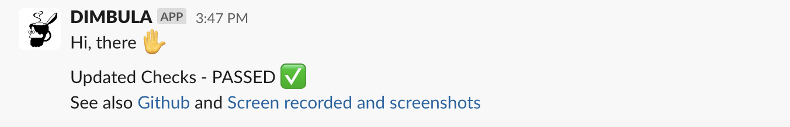

# 通知を受け取る
DIMBULA E2Eでは、E2Eテストの終了時やGithub Checks更新時に、指定のSlackチャンネルに通知することが出来ます。

通知を受け取る設定をしていなくても、DIMBULA E2Eは機能しますが、テストが終了したことに気付かないといったことを避けるために、登録する方が良いでしょう。

# セットアップ
通知を受信したいチャンネルで、`/dimbula subscribe`を入力して、通知を受けたいDIMBULA E2Eの対象リポジトリを選択します。

設定すると、以下のようなメッセージがポストされます。

リポジトリは100件までしか表示されないため、表示されなかったリポジトリを指定したい場合は、 `/dimbula subscribe <リポジトリンURL>`を入力することで、直接対象のリポジトリを絞り込んで選択することができます。

# 通知のイメージ
DIMBULA E2Eで指定の言語、端末やOSバージョンの組み合わせで、全てのE2Eテストが終えたときやChecksが更新されたときに、以下のような内容でポストされます。

