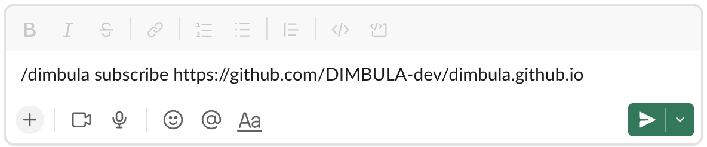
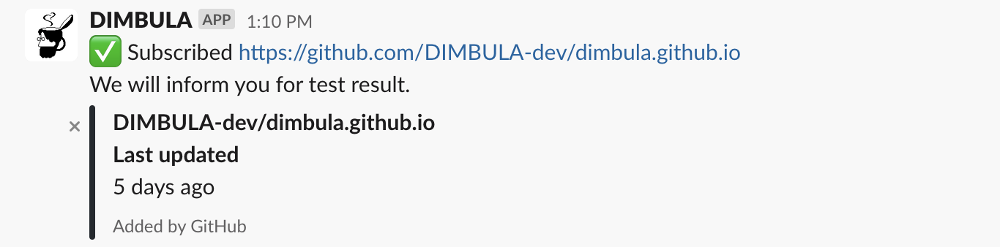

# 通知を受け取る
DIMBULA teaBreakでは、E2Eテストの終了時や、Github Checks更新時に、講読されたSlackチャンネルに通知してお知らせします。

通知を受け取る設定をしていなくても、DIMBULA teaBreakは機能しますが、テストが終了したことに気付かないといったことが起きますので、登録しておく方が良いでしょう。

# セットアップ
通知を受信したいチャンネルで、`/dimbula subscribe <GithubリポジトリURL>`を入力して、通知を受けたいDIMBULA teaBreakの対象リポジトリを指定します。

設定が完了すると、以下のようなメッセージがポストされます。

# 通知のイメージ
DIMBULA teaBreakで指定の言語、端末やOSバージョンの組み合わせで全てのE2Eテストが終えたときやChecksが更新されたときに、以下のような内容でポストされます。

