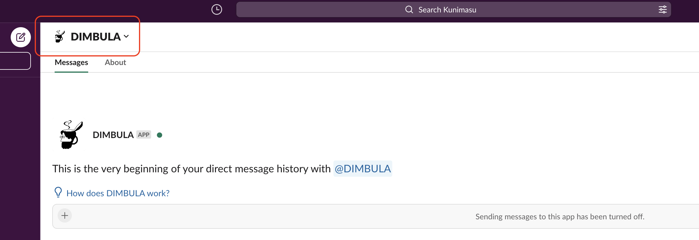
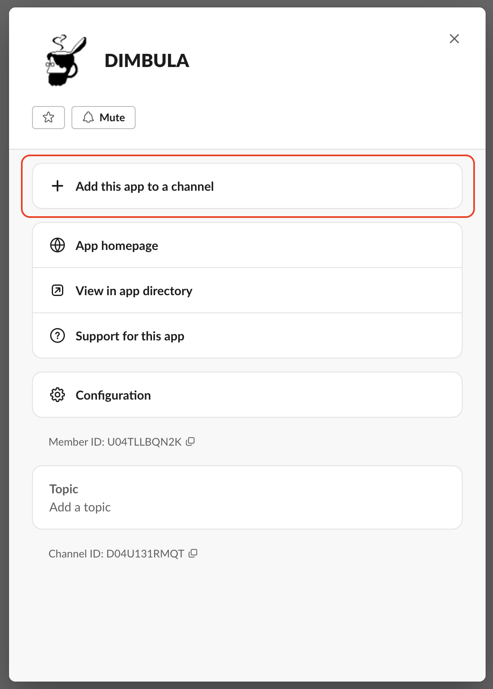
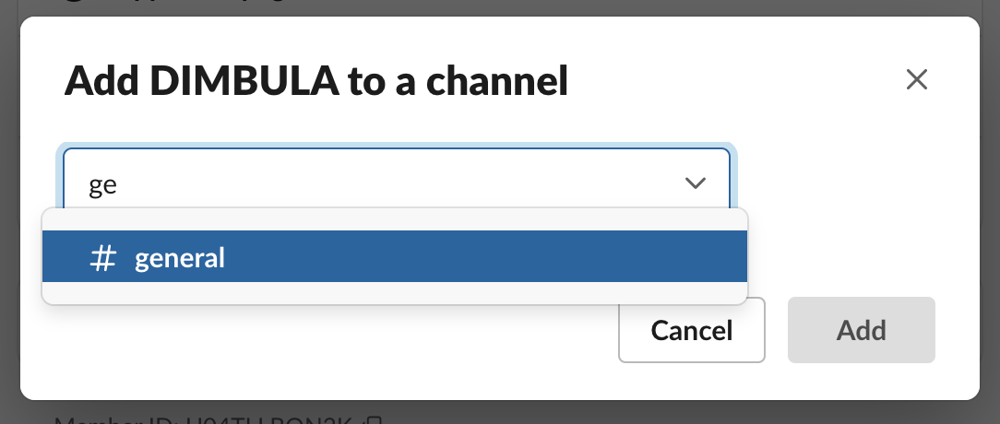

# Slackセットアップ

# アプリのインストール
DIMBULAのSlackアプリをSlackワークスペースにインストールしてください。

<!--

-->

**現在、招待制でご利用いただいています。**

# DIMBULAをチャンネルに追加
次に、DIMBULAと対話的なコミュニケーションを行うために、Slashコマンドを使うチャンネルにDIMBULAを追加します。

# DIMBULAのセットアップ
チャンネル追加後、`/dimbula me`のコマンドを送信して、DIMBULAのアクティベイトを行ってください。所有者、管理者以外のユーザは初回に利用規約に同意してからご利用ください。

コマンドの使い方については、`/dimbula help`を送信して確認できます。
