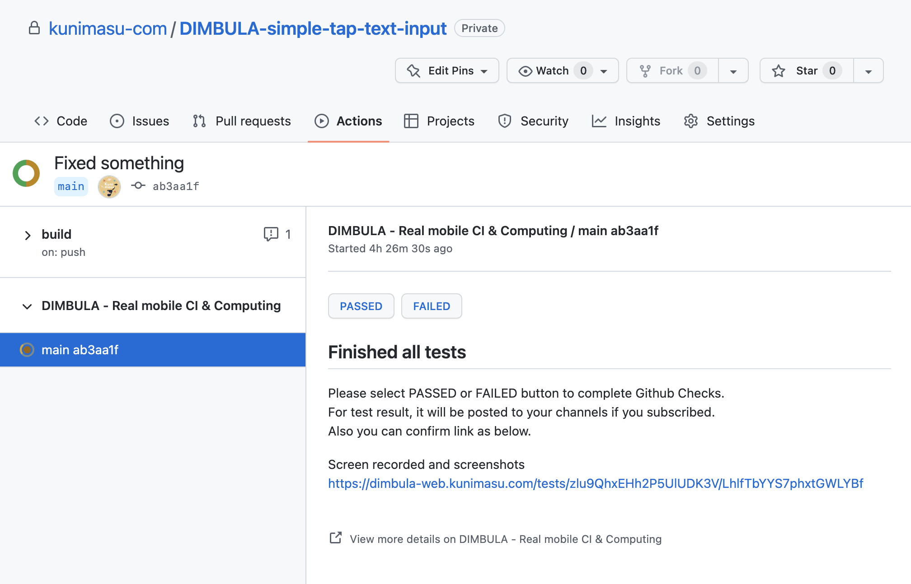

# Githubインテグレーション
Githubと連携する目的は、Github ActionsからDIMBULA E2Eを活用するためです。そのためにDIMBULAでは、専用のGithubアプリとアクションを提供しています。

# Githubアプリ
DIMBULAのGithubアプリは、2つの役割を持ちます。

まず、Githubアプリは`Checks`への**Read**と**Write**の権限を要求します。ソースコードのPushやPull Requestの作成などで、起動されたGithub ActionsからDIMBULAを呼び出すと、Workflow runに対してChecksを作成します。最終的にこのChecksは、テストした内容を確認した利用者によってE2Eテストが成功したかどうかを更新します。

Githubのブランチ保護機能の1つに、マージ前にChecksがパスしているかどうかを設定できる機能があります。DIMBULAが作成・更新するChecksは、この強力なブランチ保護機能に作用するE2Eテストとしてご利用いただけます。

もう1つの役割は、Githubアプリは組織へインストールできるため、社員の退職に伴うアクセストークンの変更作業といった対応に追われることがなくなります。個人アカウントでOAuth認証し、アクセストークンを得てGithubのリソースへアクセス方法では、こういった個人の問題がそのまま組織に現れてしまうので、Githubアプリで事前に避けられます。

# 専用アクション
DIMBULAの専用アクションは、DIMBULAへのテストをリクエストするトリガーの役割になります。アクション1つ呼び出す記述を追加するだけで、DIMBULA E2Eをご利用いただけます。

