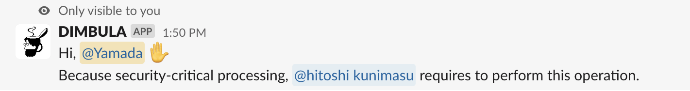

# Slackインテグレーション
DIMBULAは、Slackを最大限活用したユーザインターフェースになっています。マルチプラットフォームで様々な利用環境があることの他にも、Slackを活用する理由を紹介します。

# ユーザ管理
DIMBULAにはユーザ作成や管理、招待を行う機能がありません。

Slackの既存のメンバー管理、権限設定を活用し、Slackのワークスペースに参画するメンバーであれば、DIMBULAの利用者としてすぐにご利用になれます。DIMBULAの利用を終了する場合など、重要な要求に対しては、Slackワークスペースの所有者もしくは管理者権限をチェックします。

もし必要な権限を満たしていない操作を行おうとすると、以下のメッセージがポストされます。

# 通知
DIMBULAのSlashコマンドは非同期に結果を応答するものや、Githubからの通知を受けます。DIMBULAでは独自のユーザインターフェースがない代わりに、柔軟且つ強力なSlackの通知システムを利用できます。
通知を受け取る条件や粒度、Webブラウザやネイティブアプリ、メールでの受信といったきめ細かい通知システムの恩恵があることが、Slackインターフェースを採用した理由の1つです。

# ユーザインターフェース
Slashコマンドの対話的なコミュニケーションは、テキストベースのみならず、モーダルUIでより使い勝手の良いユーザインターフェースを提供します。

例えば、`/dimbula use`を送信すると、利用したいモバイルを選択するときは、モーダルUIを表示します。その後、モバイルが確保されると、DIMBULAからリンクがポストされます。
目的に合わせてSlackが提供するユーザインターフェースを柔軟に活用できる点は非常に魅力的です。

