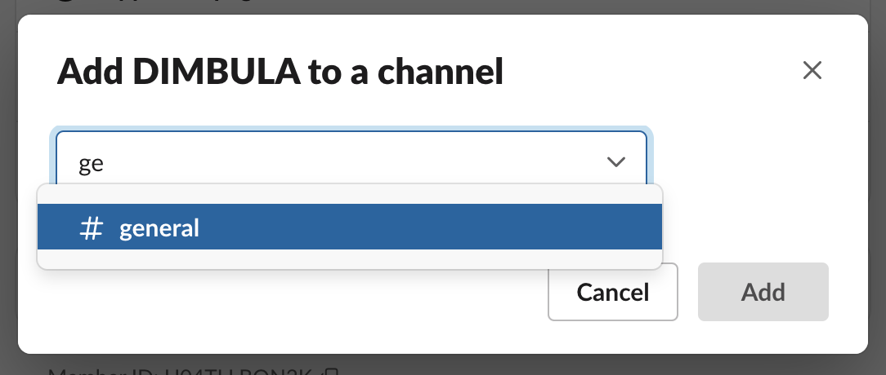
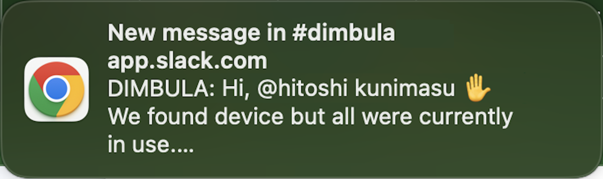

# Slack連携
DIMBULAでは、以下の目的でWebブラウザを使いますが、それ以外のことはSlashコマンドを使ってDIMBULAを利用します。

* DIMBULA SlackアプリをSlackワークスペースにインストールし、初回にアクティベイトするため
* DIMBULA teaBreakを使うために、Githubへログインして、アクセストークンを取得するため
* DIMBULA teaBreakで録画したテスト中の動画やスクリーンショットを確認するため
* DIMBULA atWorkを使うため
* また、上記のためにブラウザでログインするため

# セットアップ
まずは、DIMBULAのSlackアプリをSlackワークスペースにインストールしてください。

次に、DIMBULAと対話的にご利用になるために、Slashコマンドを利用になるチャンネルにDIMBULAアプリを追加してください。

チャンネルに追加後、`/dimbula me`のコマンドを送信してみてください。

# ユーザ管理
DIMBULAにはユーザ作成や管理、招待を行う機能がありません。

Slackの既存のメンバー管理、権限設定を活用し、Slackのワークスペースに参画するメンバーであれば、DIMBULAの利用者としてそのままSlashコマンドをご利用になれます。DIMBULAの利用を終了する場合など、重要な要求に対しては、Slackワークスペースの所有者もしくは管理者権限をチェックします。

もし必要な権限を満たしていない操作を行おうとすると、以下のメッセージがポストされます。

# 通知
DIMBULAをご利用になる場合、SlackのSlashコマンドを活用し、DIMBULAへ要求しますが、Slashコマンドの応答が非同期で行われるものやGithubからの通知など、利用者へ必要な通知はSlackに対して行われます。通知を受け取る条件や粒度、Webブラウザやネイティブアプリ、メールといったきめ細かい通知システムを完備していて、Slackの通知機能は柔軟且つ強力です。故に、Slackをユーザインターフェースに活用する理由の1つでもあります。

# Slashコマンド

DIMBULAは、冒頭のブラウザが必要な場合を除き、ほとんどがSlashコマンドを利用した使い方になります。
ここでは、よく使う一部のコマンドを紹介します。他のコマンドについては、`/dimbula help`を実行し、どんなコマンドがあるのか一読ください。

## `/dimbula me`
アカウントについて情報を表示します。

SlackのワークスペースにインストールしたDIMBULAアプリをアクティベイトするために、初回はワークスペース所有者又は管理者権限を持つ利用者が`Activate`リンクからアクティベーションを行ってください。

アクティベイト済みの場合は、以下のようにメッセージが表示されます。

DIMBULA teaBreakを使うために、Githubと接続されていれば、以下のメッセージがポストされます。

各リンク、ボタンについて以下に説明します。
* `Activate`は、管理者又は所有者のみ実行可能で、Slackワークスペースを有効化する
* ワークスペースの`reconect`も上記同様
* `Sign in`は、ブラウザにログインセッションを作成する
* `Sign out`は、ブラウザに残っているログインセッションを破棄する
* Githubの`connect` `reconnect` は、DIMBULA teaBreakを利用するためのGithubのアカウントを接続する
* `Disconnect Github`は、接続したGithubアカウントの切断する
* `Delete from DIMBULA`は、DIMBULAの利用を終了するため、ワークスペースを削除する

## `/dimbula use`
DIMBULA atWorkを利用するときに使用するコマンドです。

モーダル表示で具体的に利用可能なモバイルの選択肢を表示されます。

モバイルの確保が出来ると、リンクがポストされるので、ブラウザで表示します。

## `/dimbula quit`
現在利用中のモバイルの終了を行います。 終了の同意にチェックを入れて確定します。

終了後、以下のメッセージがポストされます。

## `/dimbula subscribe`

Github連携し、DIMBULA teaBreakでE2Eテストを行うとき、テスト終了の通知やGithub Checksを更新したときにGithubからの通知を受け取りたいリポジトリとチャンネルを登録します。コマンドを実行すると、選択可能なGithubのリポジトリの選択肢が表示されます。

対象のリポジトリは、DIMBULAのGithubアプリをインストールした個人や組織にのリポジトリです。全ての選択可能なリポジトリのトップ100件を表示します。もし選択したいリポジトリが選択肢に現れていない場合は、`dimbula subscribe <リポジトリのURL>`などで絞り込むことができます。詳細は、`/dimbula help`をご確認ください。

